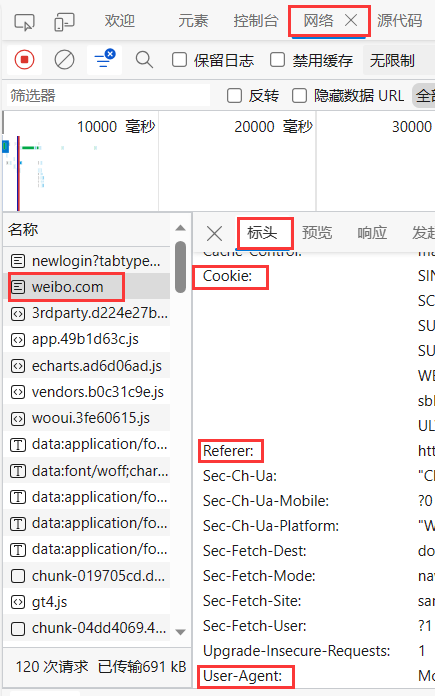
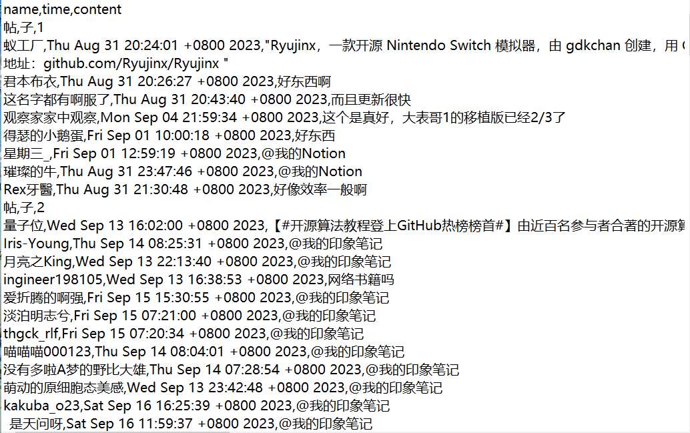

# Weibo-Crawler

免责声明：本代码仅供技术学习，请合理合法使用

使用步骤：

（1）首先登录微博网页版

​因为微博很多评论仅针对登录后的用户开放，对游客模式下有许多限制，因此首先需要登录微博

（2）在微博网页右键选择检查进入网络板块

随便选择一个包，点击标头查看Cookie，Referer和User-Agent并将其填入Crawler.py程序的对应位置中

      
（3）运行Crawler.py程序，填入想爬取的关键字即可

（4）程序默认爬取50页网页，运行结束后，会获得一个txt文档

